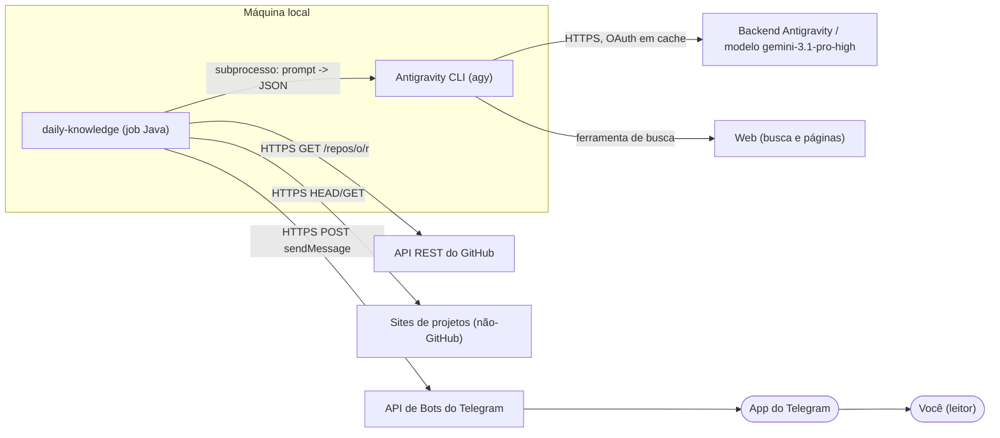
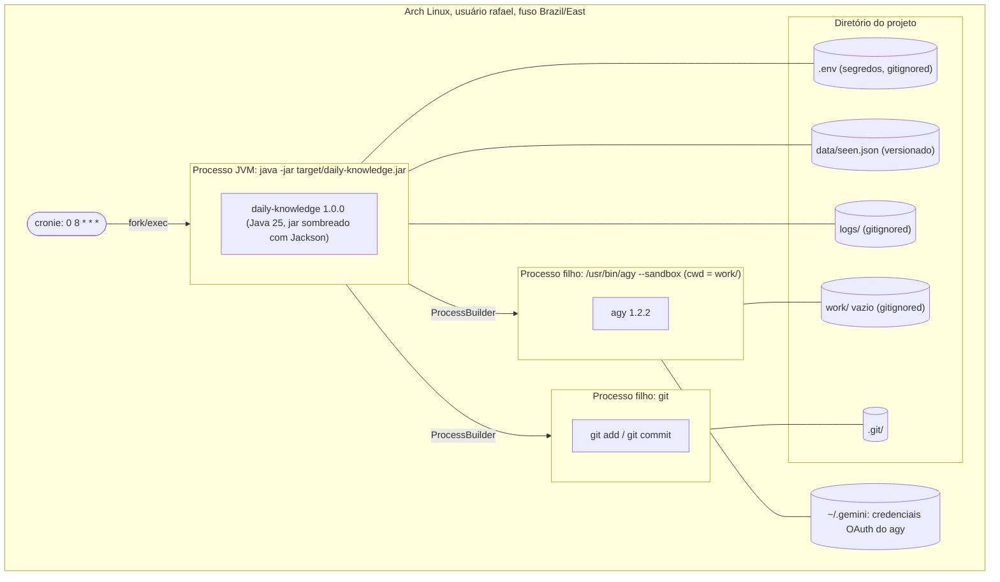
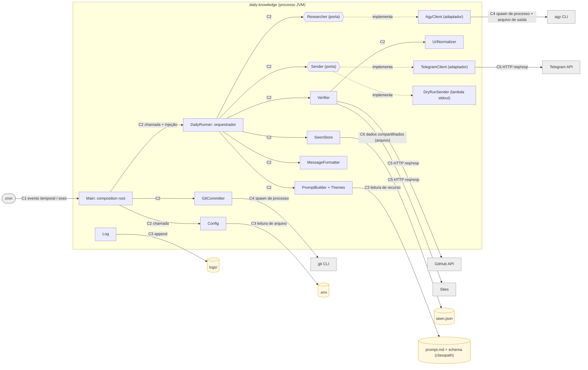
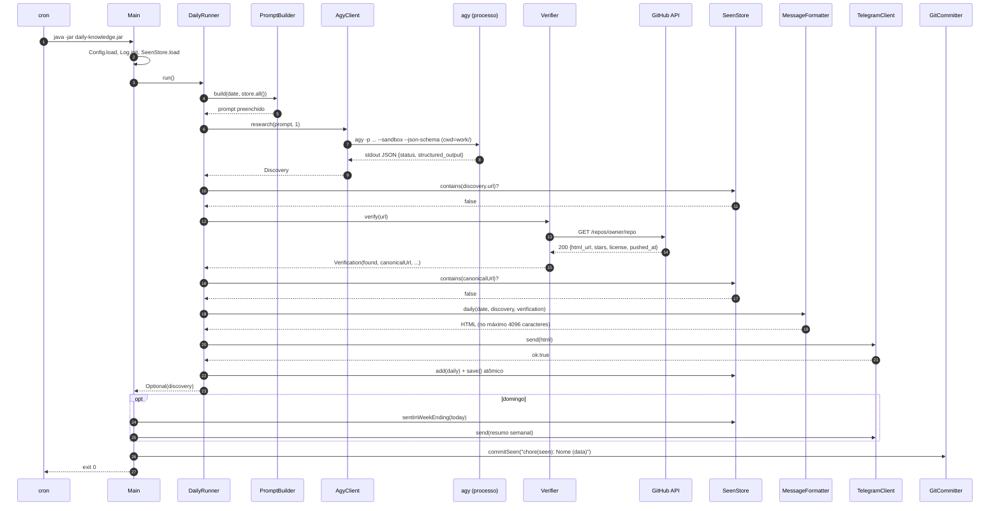
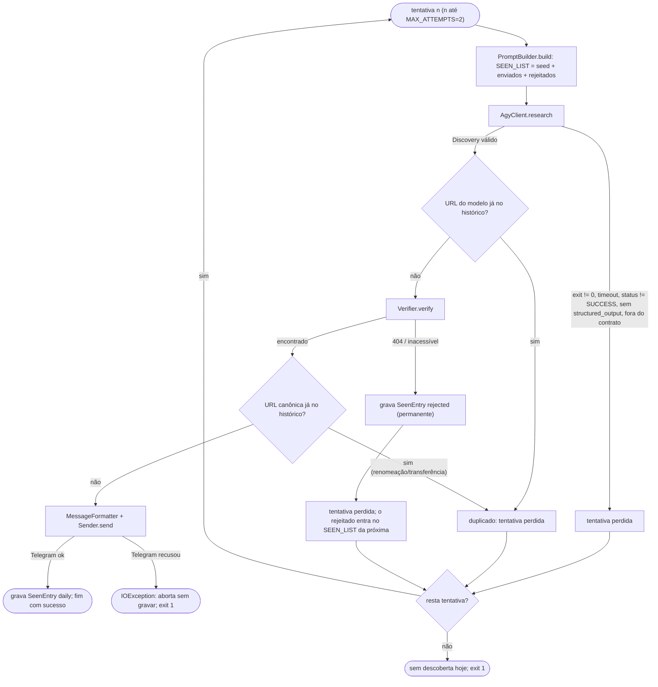
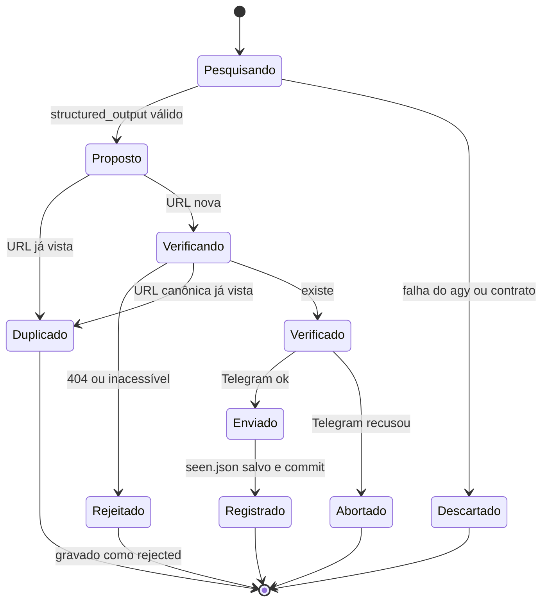

# Documento de Arquitetura: daily-knowledge

> Boletim diário de descobertas de software, entregue no Telegram.
> Este documento descreve **como** o sistema é organizado e **por que** foi organizado assim.
> Os diagramas de classes estão em [diagramas-de-classes.md](diagramas-de-classes.md).

## Sumário

1. [Visão geral](#1-visão-geral)
2. [Requisitos e restrições que guiaram a arquitetura](#2-requisitos-e-restrições-que-guiaram-a-arquitetura)
3. [Estilo arquitetural](#3-estilo-arquitetural)
4. [Visão de contexto](#4-visão-de-contexto)
5. [Visão de implantação](#5-visão-de-implantação)
6. [Visão de componentes e conectores](#6-visão-de-componentes-e-conectores)
7. [Visão de execução (comportamento)](#7-visão-de-execução-comportamento)
8. [Visão de dados](#8-visão-de-dados)
9. [Decisões arquiteturais tomadas](#9-decisões-arquiteturais-tomadas)
10. [Decisões não tomadas (adiadas ou rejeitadas)](#10-decisões-não-tomadas-adiadas-ou-rejeitadas)
11. [Riscos, limitações e dívida técnica conhecida](#11-riscos-limitações-e-dívida-técnica-conhecida)
12. [Evidências e validação](#12-evidências-e-validação)

---

## 1. Visão geral

Uma vez por dia, um job em lote (*batch*) roda na máquina local e segue estes passos:

1. Monta um prompt de curadoria com a data, o foco do dia da semana e a lista de projetos já enviados.
2. Delega a **pesquisa** a um agente de IA (Antigravity CLI, `agy`) rodando em modo headless.
3. **Valida** a resposta do agente com fontes determinísticas: a API do GitHub ou um HEAD/GET na URL.
4. **Deduplica** contra um histórico persistido em arquivo.
5. **Formata** e **envia** a descoberta para o Telegram.
6. **Registra** o projeto no histórico e faz commit no git local.
7. Aos domingos, envia também um **resumo semanal**.

A ideia central é esta: **o LLM é usado só para o que só ele faz bem (descobrir e descrever), e tudo que precisa ser confiável (validação, memória, efeitos colaterais) fica em código determinístico.**

---

## 2. Requisitos e restrições que guiaram a arquitetura

| # | Requisito / restrição | Origem | Impacto na arquitetura |
|---|---|---|---|
| R1 | Uma descoberta nova por dia, com descrição, contexto, necessidade e origem | Pedido original | Contrato JSON fixo com esses campos |
| R2 | Nunca repetir projeto já informado | Pedido original | Histórico persistido + deduplicação em código |
| R3 | Usar o prompt final **exatamente** como foi escrito | Você | Prompt como recurso imutável; só os placeholders variam, inclusive nas novas tentativas |
| R4 | Não depender de nada genérico nem assumido | Você | Decisões explícitas, registradas neste documento |
| R5 | Rodar na máquina local, usando o Antigravity | Você | Batch local + `agy` como subprocesso |
| R6 | Java | Você | JVM, Maven, Jackson |
| R7 | Agendamento via crontab, às 08:00 | Você | Sem processo residente; o job nasce e morre a cada execução |
| R8 | Alucinação é o maior risco | Análise do plano | Verificação externa obrigatória antes de enviar |
| R9 | Tokens não podem vazar | Segurança | `.env` fora do git, token nunca logado, agente sem acesso ao token |

---

## 3. Estilo arquitetural

O sistema combina três estilos, cada um aplicado onde resolve um problema concreto:

| Estilo | Onde aparece | Por quê |
|---|---|---|
| **Batch job / processo efêmero** | O processo inteiro | O trabalho acontece uma vez por dia. Um processo residente consumiria recursos 24h e precisaria de supervisão, enquanto o cron já resolve o disparo. |
| **Pipeline com orquestrador** (variação de *pipes and filters*) | `DailyRunner` | O fluxo é linear (pesquisar → verificar → deduplicar → formatar → enviar → registrar), e cada etapa pode rejeitar o candidato. Um orquestrador explícito deixa o loop de novas tentativas legível num único lugar. |
| **Portas e adaptadores (leve)** | `Researcher`, `Sender` | Isola o que é externo e caro (LLM, Telegram) atrás de interfaces. Assim dá para testar o fluxo sem rede e trocar o motor ou o destino no futuro. |

---

## 4. Visão de contexto

Quem e o que interage com o sistema:



**Fronteira de confiança:** tudo que vem do `agy` é tratado como **entrada não confiável**. A validação acontece do lado do job, contra o schema, a API do GitHub ou um HEAD/GET, e o histórico.

---

## 5. Visão de implantação



| Artefato | Local | Versionado? | Observação |
|---|---|---|---|
| `target/daily-knowledge.jar` | build | não | O jar descobre a raiz do projeto pela própria localização (`target/..`), então o cron não precisa de `cd`. |
| `.env` | raiz | **não** | Lido pelo Java e **não exportado** para o ambiente do `agy`. |
| `data/seen.json` | raiz | sim | Recebe commit automático a cada mudança. |
| `logs/AAAA-MM-DD.log`, `logs/agy-*-attemptN.{out.json,err.txt}` | raiz | não | Log do dia e saída bruta de cada tentativa do agente. |
| `work/` | raiz | não | Diretório de trabalho **vazio** do agente: limita o que ele consegue ler ou alterar. |

---

## 6. Visão de componentes e conectores

### 6.1 Diagrama de componentes e conectores



### 6.2 Catálogo de componentes

| Componente | Responsabilidade | Depende de | Notas |
|---|---|---|---|
| `Main` | Ponto de entrada; interpreta as flags; **monta o grafo de objetos** (composition root); decide se envia o resumo semanal; dispara o commit; define o exit code | todos | Único lugar onde as implementações concretas são escolhidas |
| `Config` | Carrega o `.env` (variáveis de ambiente reais têm prioridade); valores padrão | arquivo `.env` | `toString()` mascara o token |
| `DailyRunner` | Loop de até N tentativas: pesquisar → verificar → deduplicar → enviar → registrar | `Researcher`, `Verifier`, `SeenStore`, `PromptBuilder`, `Sender` | Não conhece agy, HTTP nem Telegram, só as abstrações |
| `PromptBuilder` / `Themes` | Preenche `{{DATE}}`, `{{WEEKDAY}}`, `{{THEME}}` e `{{SEEN_LIST}}` sem tocar no resto do texto | `prompt.md` | Um teste garante que o texto fora dos placeholders é idêntico |
| `Researcher` (porta) / `AgyClient` | Executa o `agy -p` e converte `structured_output` em `Discovery` | binário `agy`, schema | Toda falha vira `ResearchException`, que conta como uma tentativa perdida |
| `Verifier` | Confirma que a URL existe; no GitHub, devolve URL canônica, estrelas, licença e último push | `HttpClient` do JDK, `UrlNormalizer` | Se a API do GitHub ficar indisponível, cai para HEAD/GET |
| `UrlNormalizer` | Forma canônica de URL para comparar; extrai `owner/repo`; host curto | — | Funções puras |
| `SeenStore` / `SeenEntry` | Histórico em memória + persistência atômica; janela semanal | `Json`, sistema de arquivos | Fonte da verdade da memória do sistema |
| `MessageFormatter` | HTML do Telegram: escape, seções opcionais, limite de 4096 caracteres; resumo semanal | `PromptBuilder` (nome do dia), `Themes`, `UrlNormalizer` | Funções puras, fáceis de testar |
| `Sender` (porta) / `TelegramClient` | Entrega da mensagem; confirma `ok: true` | `HttpClient` do JDK | No `--dry-run`, uma lambda imprime no stdout |
| `GitCommitter` | `git add` + `git commit` do `seen.json` | binário `git` | Uma falha aqui **não** invalida o envio |
| `Log` / `Json` | Infraestrutura transversal | — | Sem dependências externas |

### 6.3 Catálogo de conectores

| Id | Tipo de conector | De → Para | Protocolo / mecanismo | Dados | Tratamento de falha |
|---|---|---|---|---|---|
| C1 | Evento temporal + invocação de processo | cron → JVM | `fork/exec` pelo cronie | argumentos de linha de comando | Se o PC estiver desligado, a execução é perdida (decisão D3) |
| C2 | Chamada de procedimento | entre componentes internos | chamada de método na mesma JVM | objetos Java (records imutáveis) | exceções verificadas (`IOException`, `ResearchException`) |
| C3 | Leitura/escrita de arquivo | `Config`, `PromptBuilder`, `Log` | NIO `Files` / classpath | texto | `.env` ausente → padrões; erro de log → só stderr |
| C4 | Spawn de processo filho | `AgyClient` → agy; `GitCommitter` → git | `ProcessBuilder`; stdin `/dev/null`; stdout/stderr redirecionados para **arquivos** | prompt via argv; JSON no stdout; exit code | timeout rígido (`print-timeout` + 1 min) + `destroyForcibly`; exit ≠ 0 → tentativa falha |
| C5 | Requisição/resposta HTTP síncrona | `Verifier` → GitHub/sites; `TelegramClient` → Telegram | HTTPS via `java.net.http.HttpClient`; segue redirecionamentos (exceto no Telegram) | JSON (GitHub, Telegram); só o status (sites) | GitHub 404 → rejeita; outros erros → HEAD/GET; Telegram `ok:false` → `IOException` → exit 1 |
| C6 | Repositório de dados compartilhado | `SeenStore` ↔ `seen.json` (e indiretamente `git`) | JSON em arquivo; escrita em temporário + `ATOMIC_MOVE` | lista de `SeenEntry` | Uma escrita interrompida não corrompe o arquivo |

**Por que o stdout do `agy` vai para arquivo, e não para um pipe lido pelo Java?** Com dois pipes (stdout e stderr) lidos sequencialmente, um processo que escreve muito em stderr pode travar ao encher o buffer. Redirecionar para arquivo elimina esse deadlock e, de quebra, deixa a saída bruta de cada tentativa guardada para depuração.

---

## 7. Visão de execução (comportamento)

### 7.1 Sequência: execução diária (caminho feliz)



### 7.2 Fluxo de uma tentativa (com caminhos de rejeição)



### 7.3 Ciclo de vida de um candidato



---

## 8. Visão de dados

### 8.1 Contrato com o agente (`Discovery`)

É definido em dois lugares que precisam ficar sincronizados: o texto do [prompt](../src/main/resources/prompt.md), que é o que o modelo lê, e o [JSON Schema](../src/main/resources/discovery.schema.json), que é o que o `agy` impõe. O Java mapeia para o record `Discovery` com `snake_case`.

| Campo | Obrigatório | Nulo permitido | Uso |
|---|---|---|---|
| `name`, `url`, `category`, `license`, `language`, `tagline`, `what_it_does`, `context_and_need`, `why_interesting`, `try_it`, `theme_match` | sim | não | Mensagem e histórico |
| `website`, `origin` | sim | **sim** | Seção omitida quando nulo (o prompt manda "não invente") |
| `alternatives` | sim | lista vazia permitida | Seção omitida quando vazia |
| `sources` | sim | lista vazia permitida | Links curtos no fim da mensagem |

### 8.2 Histórico (`data/seen.json`)

```json
{
  "projects": [
    { "name": "Pandoc", "url": "https://github.com/jgm/pandoc", "source": "seed" },
    { "name": "Instancio", "url": "https://github.com/instancio/instancio",
      "tagline": "…", "sent_at": "2026-10-06T08:01:10-03:00",
      "source": "daily", "theme_match": true },
    { "name": "Fantasma", "url": "https://github.com/x/fantasma",
      "sent_at": "2026-10-07T08:00:40-03:00", "source": "rejected",
      "reason": "repositório não existe no GitHub: x/fantasma" }
  ]
}
```

| `source` | Significado | Entra no `{{SEEN_LIST}}`? | Entra no resumo semanal? |
|---|---|---|---|
| `seed` | Projetos que você já conhecia | sim | não |
| `daily` | Enviado com sucesso | sim | sim (se `sent_at` estiver nos últimos 7 dias) |
| `rejected` | URL inexistente ou inacessível | sim | não |

---

## 9. Decisões arquiteturais tomadas

Cada decisão segue o formato **contexto → decisão → alternativas rejeitadas e por quê → consequências**. O campo **Decidido por** diferencia o que você escolheu (nas perguntas do planejamento) do que eu propus ou decidi.

### Implantação e execução

#### D1. Rodar na máquina local, e não em CI na nuvem
- **Decidido por:** você.
- **Contexto:** a ideia inicial era um GitHub Actions com container efêmero.
- **Decisão:** batch local na sua máquina.
- **Alternativas rejeitadas:**
  - *GitHub Actions + agy:* o modo headless do agy depende da credencial OAuth em cache de um login interativo. Levar essa credencial para um secret de CI expõe a conta Google inteira, pode quebrar quando o refresh token rotacionar e pode esbarrar nos termos de uso da assinatura. Em repositório público, os logs também ficam públicos.
  - *GitHub Actions + API do Gemini:* resolveria a autenticação, mas exigiria trocar de motor (ver D2).
- **Consequências:** zero custo e zero credencial fora da máquina. Em troca, o sistema **só funciona com o PC ligado**.

#### D2. Antigravity CLI (`agy`) como motor de pesquisa, e não a API do Gemini direta
- **Decidido por:** você.
- **Decisão:** `agy -p` em modo headless, com o modelo `gemini-3.1-pro-high`.
- **Alternativas rejeitadas:**
  - *API do Gemini com grounding:* exigiria criar e gerenciar uma API key separada e implementar a chamada com a busca. O agy já traz busca web, ferramentas e a autenticação da assinatura que você já usa.
  - *Motor plugável (as duas opções):* custo de implementar e testar duas integrações sem necessidade atual. Ficou só **preparado**, pela porta `Researcher` (ver D9).
- **Consequências:** cada pesquisa leva de ~35 a 70s e consome cota da assinatura. O sistema depende do comportamento do CLI (flags e formato do JSON) entre versões.

#### D3. `crontab`, e não systemd timer
- **Decidido por:** você.
- **Alternativa rejeitada:** *systemd user timer com `Persistent=true`*, que recupera execuções perdidas com o PC desligado. Você preferiu o cron.
- **Consequências:** configuração mínima e familiar. Se o PC estiver desligado às 08:00, **o dia é pulado**: não há recuperação, nem descoberta extra no dia seguinte.

#### D4. Processo efêmero, e não serviço residente
- **Decidido por:** eu (decorre de D3).
- **Por quê:** um processo que nasce, faz o trabalho e morre não vaza memória, não precisa de supervisão nem de health check. O estado fica todo em arquivo.
- **Alternativa rejeitada:** um bot residente (long polling no Telegram). Ele só se justificaria com interação, como os botões 👍/👎, que ficaram fora da v1 (ver N1).

### Divisão de responsabilidades

#### D5. Java orquestra; o agente só pesquisa
- **Decidido por:** você, a partir da minha recomendação.
- **Decisão:** o `agy` recebe um prompt e devolve um JSON. Validação, histórico, envio e commit são código Java.
- **Alternativa rejeitada:** *o agy faz tudo* (pesquisa, `curl` para o Telegram, edita o `seen.json`). Foi rejeitada por quatro motivos:
  1. **Confiabilidade:** um LLM não garante que vai gravar o histórico ou que vai mandar a mensagem uma única vez.
  2. **Segurança:** o agente precisaria do token do Telegram e de permissão de escrita no projeto.
  3. **Testabilidade:** comportamento não determinístico não dá para testar.
  4. **Formato:** a mensagem do Telegram tem regras rígidas (escape, limite de 4096 caracteres), que o código cumpre sempre.
- **Consequências:** o agente roda num diretório vazio e **sem acesso ao token**. O `.env` é lido pelo Java e não é exportado para o ambiente do processo filho.

#### D6. A memória (histórico) é do código, não do modelo
- **Decidido por:** eu (proposto ainda no txt original).
- **Decisão:** o `seen.json` é a fonte da verdade. O conteúdo é injetado no `{{SEEN_LIST}}` **e** conferido em código depois da resposta.
- **Alternativa rejeitada:** confiar só no prompt para evitar repetição. LLMs às vezes repetem mesmo com a lista na frente. A lista no prompt reduz repetições; a checagem em código as elimina.
- **Consequências:** proteção dupla. O custo é que um modelo teimoso gasta uma tentativa.

#### D7. Saída estruturada com `--json-schema`, lendo `structured_output`
- **Decidido por:** eu, com base no teste exploratório (spike).
- **Contexto:** no spike, o campo `response` veio com o JSON dentro de um bloco de código **e** com texto extra depois. O campo `structured_output` veio limpo e validado.
- **Alternativas rejeitadas:**
  - *Extrair o JSON do texto do `response` com regex:* frágil e sujeito a lixo.
  - *Pedir só pelo prompt:* o prompt já pede "APENAS JSON", mas um pedido não é garantia.
- **Consequências:** o contrato é imposto duas vezes, pelo schema no agy e pelo `Discovery.validate()` no Java. **O schema e o prompt precisam evoluir juntos.**

### Validação e deduplicação

#### D8. Verificação externa obrigatória antes de enviar
- **Decidido por:** você (escolheu os extras "validar URL" e "enriquecer com o GitHub").
- **Decisão:**
  - URL do GitHub → `GET /repos/{owner}/{repo}` na API pública, que segue redirecionamentos.
  - Outras URLs → HEAD, com GET como fallback.
  - Repositório arquivado → **aceito**, por decisão sua, porque o prompt admite ferramentas "prontas e estáveis".
- **Por que a API, e não um HEAD em `github.com/o/r`:** a API devolve dados **reais** (URL canônica, estrelas, licença, último push), que substituem informações que o modelo poderia ter inventado.
- **Licença:** vale o `spdx_id` do GitHub. Se vier `null` ou `NOASSERTION` (caso real do Vendure), fica a licença informada pelo modelo.

#### D9. Deduplicar pela URL **canônica**, e não pelo nome nem pela URL do modelo
- **Decidido por:** eu, com base em evidência.
- **Contexto:** ao verificar o seed, `vendure-ecommerce/vendure` redirecionou para `vendurehq/vendure` e `safishamsi/graphify` redirecionou para `Graphify-Labs/graphify`.
- **Decisão:** compara-se a URL normalizada do modelo **e** o `html_url` devolvido pela API.
- **Alternativas rejeitadas:**
  - *Por nome:* existem homônimos (há vários "Handy" e "Odysseus"), o que geraria falsos positivos.
  - *Só pela URL do modelo:* não detecta renomeações nem transferências, coisa que o próprio prompt pede.
- **Consequências:** detecta renomeações no GitHub. Forks com outro nome continuam dependendo do prompt (ver R-4).

#### D10. No máximo 2 tentativas; o texto do prompt nunca muda
- **Decidido por:** você.
- **Decisão:** um candidato rejeitado é gravado e entra no `{{SEEN_LIST}}` da tentativa seguinte. Nenhuma frase extra é adicionada ao prompt.
- **Alternativas rejeitadas:**
  - *Adicionar uma frase de retry explicando o motivo:* violaria R3.
  - *3 ou 5 tentativas:* cada tentativa custa ~1 min e cota do modelo Pro; mais de 2 indica um problema que deve aparecer no log, e não ser escondido.
- **Consequências:** num dia ruim, nenhuma mensagem é enviada. O processo sai com exit 1 e o motivo fica no log.

#### D11. Rejeitados ficam gravados para sempre
- **Decidido por:** você.
- **Alternativa rejeitada:** valer só para a execução do dia. Um projeto inexistente que o modelo alucinou uma vez tende a ser alucinado de novo.
- **Consequências:** o `seen.json` cresce também com rejeitados. Se uma URL ficar fora do ar só temporariamente, aquele projeto é perdido de vez. É um custo aceito.

### Persistência

#### D12. Arquivo JSON versionado, e não banco de dados
- **Decidido por:** eu.
- **Por quê:**
  - o volume é pequeno (~365 entradas por ano);
  - o arquivo pode ser lido e editado à mão;
  - o diff aparece no git;
  - não precisa de servidor nem de driver.
- **Alternativas rejeitadas:**
  - *SQLite:* traria dependência JDBC e um arquivo binário opaco no git, sem nenhuma consulta que justifique.
  - *Banco servidor:* desproporcional para o problema.
- **Consequências:** o arquivo é carregado inteiro na memória, o que é trivial nesse volume. Não há concorrência entre escritores (ver R-3).

#### D13. Escrita atômica (arquivo temporário + `ATOMIC_MOVE`)
- **Decidido por:** eu.
- **Por quê:** se a energia cair ou o processo for morto no meio da escrita, um JSON truncado destruiria toda a memória do sistema. Com o `rename` atômico, o arquivo fica inteiro: ou na versão antiga, ou na nova.

#### D14. Gravar no histórico **depois** que o Telegram confirma
- **Decidido por:** eu.
- **Contexto:** gravar e enviar não acontecem numa única transação, então uma das duas ordens precisa ser escolhida.
- **Decisão:** primeiro envia, depois grava (semântica *at-least-once*).
- **Alternativa rejeitada:** gravar antes de enviar (*at-most-once*). Se o envio falhasse, o projeto ficaria marcado como visto sem nunca ter chegado até você, uma perda silenciosa.
- **Consequências:** se o processo morrer entre o envio e a gravação, o projeto pode ser reenviado num dia futuro. Uma repetição visível é preferível a uma perda invisível.

#### D15. Commit automático do `seen.json`
- **Decidido por:** você.
- **Por quê:** dá trilha de auditoria (quando cada projeto foi enviado ou rejeitado) e facilita voltar o histórico se algo der errado.
- **Decisão complementar (eu):** uma falha no commit só gera aviso no log, porque o envio, que é o que importa, já aconteceu.

### Apresentação

#### D16. O código formata a mensagem, não o modelo
- **Decidido por:** eu (proposto no txt original).
- **Por quê:**
  - o escape de HTML e o limite de 4096 caracteres precisam ser **sempre** respeitados;
  - o layout fica idêntico todo dia;
  - o contrato JSON fica independente do canal, então o mesmo `Discovery` poderia gerar um e-mail ou uma página.

#### D17. `parse_mode=HTML`, e não MarkdownV2
- **Decidido por:** eu.
- **Por quê:** no HTML basta escapar `<`, `>` e `&` (mais `"` em atributos). No MarkdownV2 do Telegram é preciso escapar 18 caracteres (`` _ * [ ] ( ) ~ ` > # + - = | { } . ! ``), e eles aparecem o tempo todo em comandos como `try_it`. Qualquer escape esquecido faz o Telegram **recusar a mensagem inteira**.

#### D18. Estratégia de corte para caber em 4096 caracteres
- **Decidido por:** eu.
- **Decisão:**
  1. O campo de texto longo mais extenso é encurtado de forma iterativa, com "…" e mínimo de 80 caracteres.
  2. Se ainda não couber, as fontes saem.
  3. Depois, as alternativas.
  4. **A linha do título com o link nunca é cortada.**
- **Por quê:** é melhor perder detalhe do que perder a mensagem (o Telegram recusa acima do limite) ou perder o link, que é o valor principal.

#### D19. Resumo semanal derivado do histórico
- **Decidido por:** você (domingo manda as duas coisas) e eu (implementação).
- **Decisão:** o resumo é gerado a partir de `source=daily` com `sent_at` nos últimos 7 dias. Não existe armazenamento separado. É enviado **mesmo que a descoberta de domingo falhe**.
- **Por quê:** uma fonte única da verdade. O resumo não depende do sucesso do dia.

### Plataforma e código

#### D20. Java 25 (LTS) + Maven + Jackson + jar sombreado
- **Decidido por:** você (Java, Maven/Jackson, versão 25) e eu (shade).
- **Alternativas rejeitadas:**
  - *Single-file sem dependências:* exigiria um parser de JSON feito à mão, propenso a bugs justamente na fronteira com o LLM.
  - *Java 26 como alvo:* não é LTS. O JDK 26 instalado compila para 25 sem problemas.
  - *Classpath com `lib/` separada:* o cron chamaria vários arquivos; o jar único simplifica.

#### D21. Sem framework (nada de Spring Boot); injeção manual no `Main`
- **Decidido por:** eu.
- **Por quê:**
  - são cerca de 15 classes e um único fluxo;
  - um container de DI acrescentaria segundos de startup, dezenas de MB de dependências e "mágica" de configuração, tudo sem retorno;
  - o `Main` como *composition root* deixa todas as dependências visíveis em ~20 linhas;
  - `java.net.http.HttpClient` (JDK) substitui OkHttp ou WebClient sem nenhuma dependência.
- **Consequências:** se o projeto crescer muito (várias fontes, vários canais), vale reavaliar.

#### D22. Portas só onde há custo externo: `Researcher` e `Sender`
- **Decidido por:** eu.
- **Por quê:** as duas pontas mais caras ou não determinísticas (LLM e Telegram) precisam ser substituíveis nos testes e são as candidatas reais a troca (outro motor, outro canal).
- **Exceção consciente:** `Verifier` é uma classe concreta, que os testes estendem. Faltou uma interface ali. Funciona, mas não é o ideal (ver dívida T-2).

#### D23. Logger próprio, e não SLF4J/Logback
- **Decidido por:** eu.
- **Por quê:** o projeto só precisa de "linha com timestamp em stderr e num arquivo do dia". Isso cabe em ~50 linhas sem dependência nem arquivo de configuração.
- **Consequências:** não há níveis configuráveis nem rotação (ver T-3).

#### D24. Fuso fixo `America/Sao_Paulo` no código
- **Decidido por:** eu.
- **Por quê:** o tema e o resumo dependem do **dia da semana local**. Fixar o fuso torna o comportamento determinístico mesmo se o fuso do sistema mudar, por exemplo numa viagem ou num container.

#### D25. Raiz do projeto descoberta pela localização do jar
- **Decidido por:** eu.
- **Por quê:** o cron pode rodar com qualquer diretório atual. Se o jar está em `target/`, a raiz é `target/..`; caso contrário, vale o diretório atual. Validado rodando a partir de `/tmp`.

#### D26. Isolamento do agente: `work/` vazio + `--sandbox` + `--dangerously-skip-permissions`
- **Decidido por:** você, a partir da minha recomendação.
- **Contexto:** no modo headless, ferramentas que pedem aprovação são negadas, o que impediria a busca. E, diferente de um container efêmero, aqui o agente roda **no seu PC**.
- **Alternativas rejeitadas:**
  - *Skip sem sandbox:* risco desnecessário de comandos com efeito na máquina.
  - *Allowlist só de ferramentas web:* exigiria testar regras de permissão no headless sem garantia de funcionar.
- **Consequências:** o agente não enxerga o projeto (diretório vazio), tem o terminal restrito e não recebe o token.

#### D27. Configuração em `.env`, segredos nunca logados
- **Decidido por:** você (`.env`) e eu (detalhes).
- **Decisão:**
  - variáveis de ambiente reais têm prioridade sobre o `.env`;
  - `Config.toString()` mostra só `telegramConfigured=true/false`;
  - a URL do Telegram, que contém o token, nunca é logada.

#### D28. Flags `--dry-run` e `--weekly-only`
- **Decidido por:** eu.
- **Por quê:** permitem testar o caminho real (agy, GitHub, formatação) sem enviar e sem sujar o histórico, e testar a entrega no Telegram sem gastar uma pesquisa.

#### D29. Saída bruta de cada tentativa preservada em `logs/`
- **Decidido por:** eu.
- **Por quê:** quando o LLM se comporta mal, o diagnóstico depende do que ele respondeu de fato. Sem isso, um erro de "fora do contrato" às 08:00 não tem como ser investigado.

#### D30. Falha só no log + exit code, sem alerta no Telegram
- **Decidido por:** você (o alerta não foi escolhido entre os extras).
- **Consequências:** num dia sem mensagem, a causa está em `logs/AAAA-MM-DD.log`.

---

## 10. Decisões não tomadas (adiadas ou rejeitadas)

Coisas que **deliberadamente não estão** no sistema, e por quê:

| # | Não foi feito | Por quê | Como encaixaria no futuro |
|---|---|---|---|
| N1 | Botões 👍/👎 com aprendizado de gosto | Exige receber eventos do Telegram, seja por um processo residente (webhook ou long polling) ou por leitura de `getUpdates` na execução seguinte, além de um campo de nota no histórico. Não foi escolhido para a v1. | Ler `getUpdates` no início do job, gravar `rating` no `SeenEntry` e injetar "curtiu/não curtiu" num placeholder novo, o que exigiria mudar o prompt (R3) |
| N2 | Alerta de falha no Telegram | Não foi escolhido por você | Um `try/finally` no `Main` enviando uma mensagem curta pelo `Sender` |
| N3 | Execução em CI/nuvem | Ver D1 | `Researcher` com outro adaptador (API do Gemini) + workflow agendado |
| N4 | Recuperar execuções perdidas com o PC desligado | Ver D3 | systemd timer com `Persistent=true`, sem mudar o código |
| N5 | Motor plugável (agy ou API do Gemini) | YAGNI: só um motor é usado | Basta uma nova implementação de `Researcher`, escolhida no `Main` pelo `.env` |
| N6 | Banco de dados | Ver D12 | `SeenStore` concentra todo o acesso; trocar o backend não afeta o resto |
| N7 | Repetir o envio ao Telegram com backoff | Uma falha do Telegram é rara e, por D14, nada é gravado; repetir na hora complicaria o fluxo sem ganho claro | Um loop de repetição dentro do `TelegramClient` |
| N8 | Trava contra execuções simultâneas | O cron dispara uma vez por dia e uma execução dura ~1–2 min; a chance de sobreposição é baixa | `flock` na linha do crontab, ou um `FileLock` no `Main` |
| N9 | `GITHUB_TOKEN` | Sem token, a API permite 60 req/h, e o job faz de 1 a 2 | Header `Authorization` no `Verifier`, lido do `.env` |
| N10 | Validar `sources` e `alternatives` | Só a URL principal é crítica; validar todas as fontes multiplica o tempo e os falsos negativos (sites que bloqueiam HEAD) | Passar cada fonte pelo `Verifier` e remover as quebradas |
| N11 | Detectar forks com outro nome | A API devolve `fork`/`parent`, mas a regra "fork de projeto já visto" tem casos ambíguos (forks que viraram projetos próprios) | Usar `fork`, `parent.html_url` e `source.html_url` da API |
| N12 | Prompt e temas configuráveis fora do jar | O prompt fica versionado junto com o código e protegido por teste (R3); mudar exige rebuild, o que é intencional | Ler `prompt.md` e os temas de `config/`, com fallback para o classpath |
| N13 | Push para um remote | Adiado por você ("talvez depois no GitHub") | `git push` no `GitCommitter`, mais credencial |
| N14 | Controle do preview de link no Telegram | O comportamento padrão (preview do primeiro link) é aceitável | `link_preview_options` no corpo do `sendMessage` |
| N15 | Rotação de logs | O volume é pequeno (alguns KB por dia) | `logrotate`, ou limpeza de arquivos com mais de N dias no `Main` |
| N16 | Internacionalização | Leitor único, em pt-BR | — |

---

## 11. Riscos, limitações e dívida técnica conhecida

### Riscos

| Id | Risco | Probabilidade | Impacto | Mitigação atual |
|---|---|---|---|---|
| R-1 | Mudança no formato de saída ou nas flags do `agy` numa atualização | média | alto (nenhum envio) | `AgyClient` concentra o contrato com o CLI; testes com binário falso; log da saída bruta |
| R-2 | A credencial OAuth do agy expira | baixa/média | alto | O agy renova sozinho; se falhar, aparece no log. Um `agy` interativo reautentica |
| R-3 | Duas execuções simultâneas (manual + cron) disputando o `seen.json` | baixa | médio | Escrita atômica evita corrupção, mas não perda de atualização (ver N8) |
| R-4 | Fork ou clone com nome diferente passa pela deduplicação | média | baixo | O prompt pede para não repetir forks; ver N11 |
| R-5 | O modelo alucina conteúdo (descrição ou origem) com uma URL real | média | médio | O prompt exige verificação e `origin=null` quando não souber; os dados do GitHub substituem números do modelo; as fontes ficam visíveis para você conferir |
| R-6 | Site real bloqueia HEAD e GET de bots, e o projeto é rejeitado para sempre | baixa | baixo | User-Agent de navegador; fallback de HEAD para GET; projetos do GitHub usam a API |

### Dívida técnica

| Id | Dívida | Por que existe | Correção sugerida |
|---|---|---|---|
| T-1 | `Log` e `SeenStore` usam a constante `Main.ZONE` (dependência de uma classe "de baixo" para o ponto de entrada) | Atalho para não espalhar o fuso | Mover `ZONE` para `Config` ou para uma classe `Clock`/`Zone` própria |
| T-2 | `Verifier` é uma classe concreta e não tem interface | Implementação inicial; os testes estendem a classe | Extrair uma interface `Verifier`, com `HttpVerifier` como implementação |
| T-3 | `Log` é estático e global, sem rotação | Ver D23 | Aceitável enquanto o projeto for pequeno |
| T-4 | O log "Descoberta enviada" aparece também no `--dry-run` | O `DailyRunner` não sabe que está em dry-run (o `Sender` é que muda) | Ajustar a mensagem para "Descoberta entregue ao Sender" ou passar uma flag |
| T-5 | O schema e o texto do prompt descrevem o mesmo contrato em dois lugares | O agy recebe os dois separadamente | Um teste que compare os campos do schema com o exemplo JSON do prompt |

---

## 12. Evidências e validação

| Evidência | Resultado | Decisões sustentadas |
|---|---|---|
| Spike do agy sem TTY, com `--sandbox`, `--json-schema` e stdout em arquivo | `exit=0`; `structured_output` limpo; `response` com texto extra | D7, D26, viabilidade de D2 |
| Verificação do seed pela API do GitHub | Dois redirecionamentos reais (Vendure, Graphify); `NOASSERTION` no Vendure | D8, D9 |
| `mvn test` | 31 testes, 0 falhas, sem rede | D10, D13, D14, D16–D18, D22 |
| Dry run ponta a ponta com `env -i` a partir de `/tmp` | Autenticação OK fora da sessão gráfica; raiz detectada; Instancio na 1ª tentativa (~70s); enriquecimento OK; `seen.json` intacto | D1, D5, D25, D28 |
