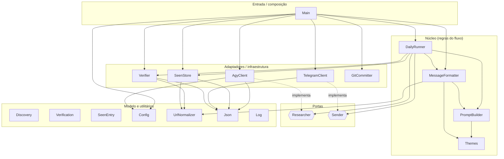
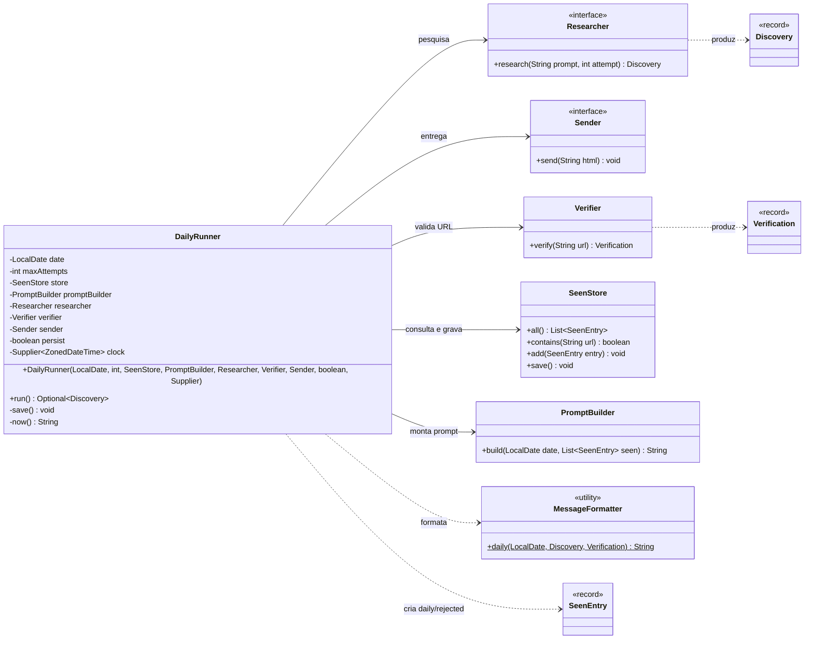
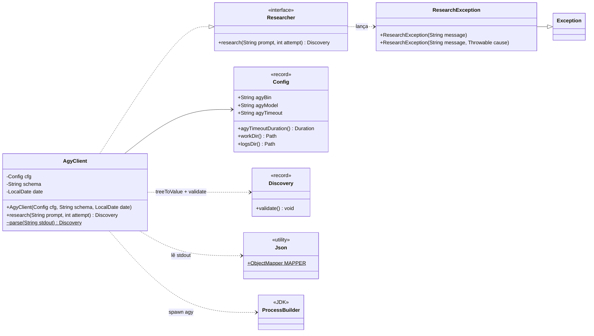
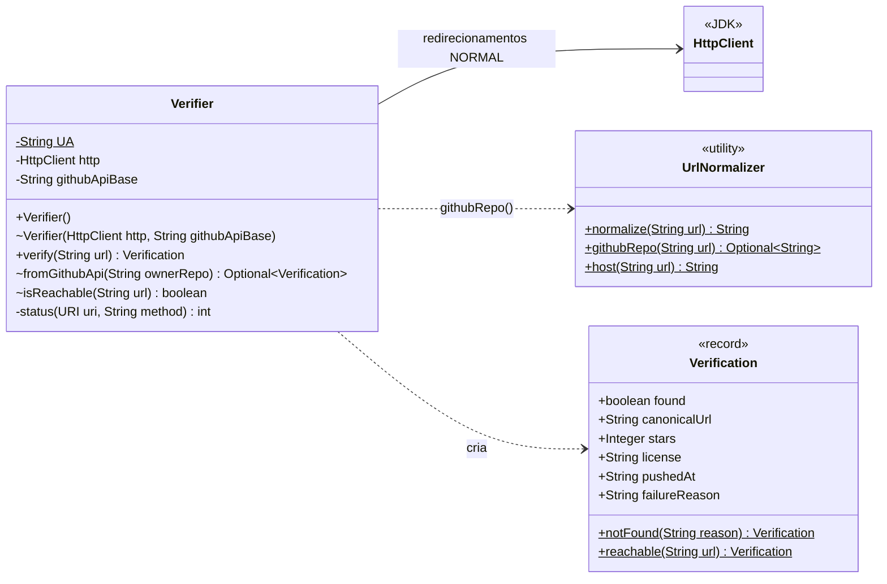
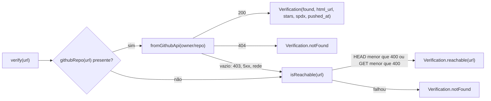
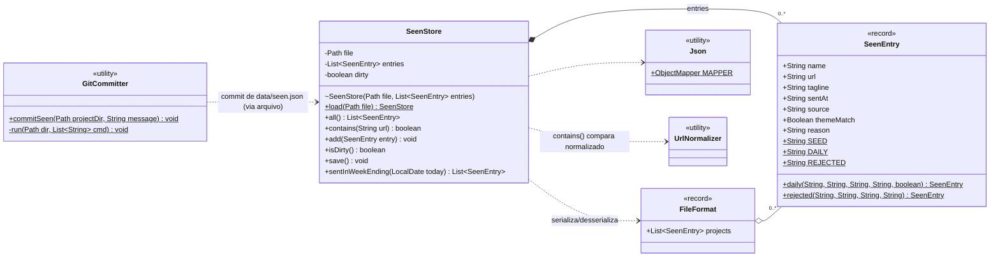
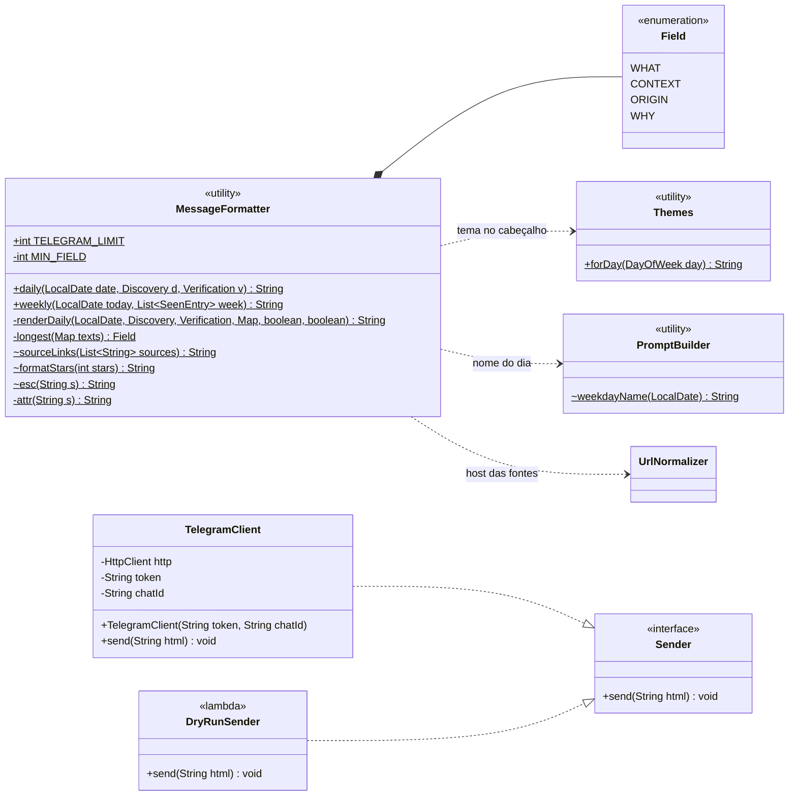
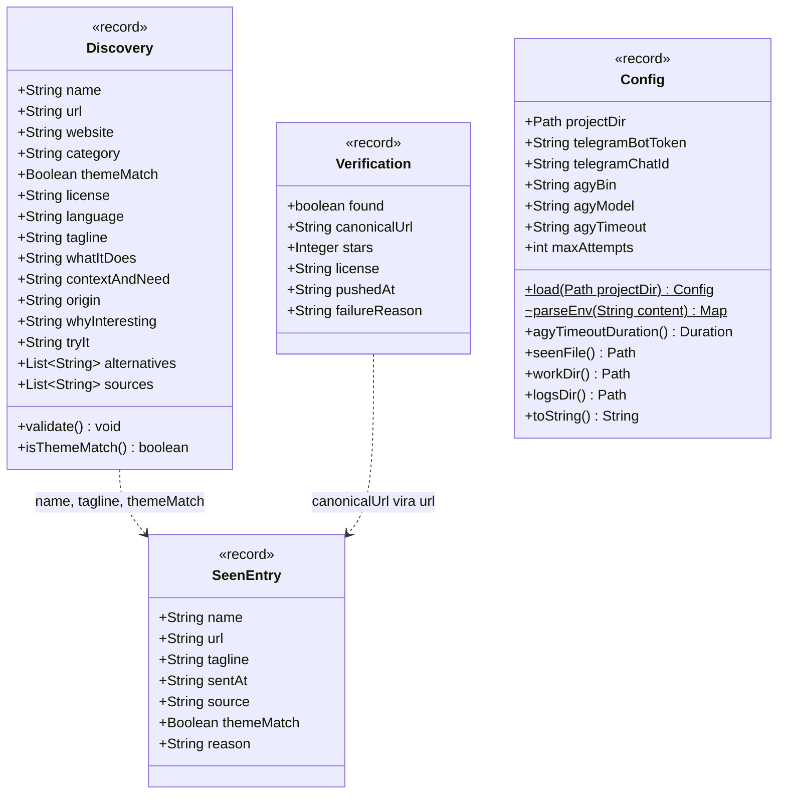
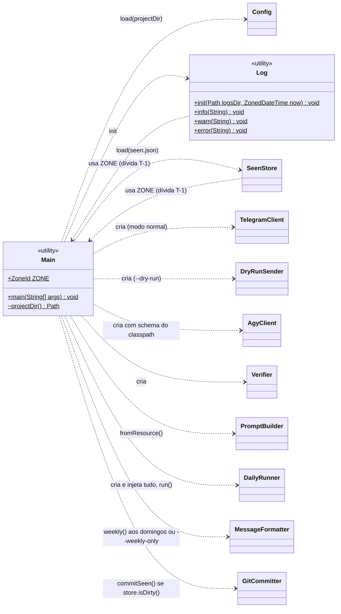
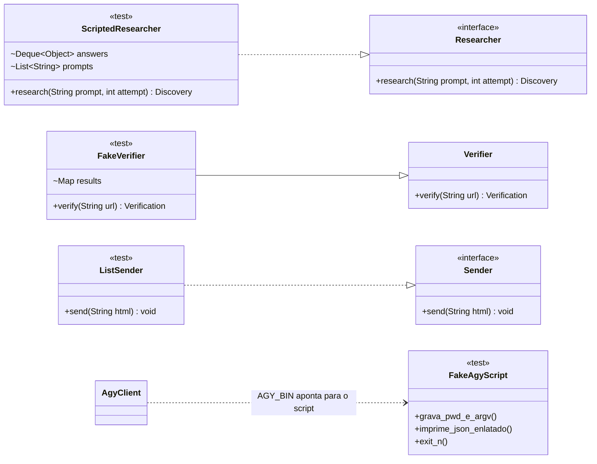

# Diagramas de Classes: daily-knowledge

> Complementa o [documento de arquitetura](arquitetura.md). Todas as classes ficam no pacote
> `dev.rafael.dailyknowledge`, em `src/main/java`. Os diagramas refletem o código atual.

**Convenções usadas nos diagramas**

| Notação | Significado |
|---|---|
| `<<interface>>` / `<<record>>` / `<<enumeration>>` / `<<utility>>` | Tipo do elemento (`utility` = classe `final` só com métodos estáticos) |
| `+` / `-` / `~` (ou sem símbolo) | público / privado / visibilidade de pacote |
| `$` no fim do membro | membro estático |
| `..\|>` | implementa interface |
| `--\|>` | herança |
| `*--` | composição (o todo é dono das partes) |
| `-->` | associação (mantém referência) |
| `..>` | dependência (usa, cria ou lança) |

## Sumário

1. [Visão geral das dependências](#1-visão-geral-das-dependências)
2. [Núcleo: orquestração do fluxo diário](#2-núcleo-orquestração-do-fluxo-diário)
3. [Porta de pesquisa: Researcher e AgyClient](#3-porta-de-pesquisa-researcher-e-agyclient)
4. [Verificação e normalização de URLs](#4-verificação-e-normalização-de-urls)
5. [Persistência: histórico e commit](#5-persistência-histórico-e-commit)
6. [Apresentação e entrega](#6-apresentação-e-entrega)
7. [Modelo de dados (records imutáveis)](#7-modelo-de-dados-records-imutáveis)
8. [Composição: o que o Main monta](#8-composição-o-que-o-main-monta)
9. [Dublês de teste](#9-dublês-de-teste)

---

## 1. Visão geral das dependências

Todas as classes, mostrando só quem depende de quem. As camadas foram agrupadas para leitura, mas não existem como pacotes Java separados.

**O que observar**
- O **`DailyRunner` não depende de nenhum adaptador concreto de I/O externo caro** (agy, Telegram). Ele conhece só as portas `Researcher` e `Sender`. A exceção é o `Verifier` (ver dívida T-2 na arquitetura).
- O `Main` é o **único** ponto que conhece as implementações concretas (*composition root*).
- `UrlNormalizer`, `Json`, `Themes` e `MessageFormatter` são folhas sem estado, fáceis de testar isoladamente.

---

## 2. Núcleo: orquestração do fluxo diário

**Decisões de design refletidas aqui**
- **Injeção por construtor** de todas as dependências, inclusive o relógio (`Supplier<ZonedDateTime>`). Assim, `sent_at` é determinístico nos testes.
- A flag `persist` (falsa no `--dry-run`) faz o `DailyRunner` executar o fluxo inteiro sem gravar o histórico.
- `run()` devolve `Optional<Discovery>`, e não `boolean`. O `Main` usa o nome do projeto na mensagem de commit.
- Exceções: `ResearchException` é **capturada** dentro do loop (conta como tentativa perdida). Uma `IOException` do `Sender` ou do `save()` **sobe** para o `Main`, porque sem envio ou sem gravação não faz sentido continuar tentando.

---

## 3. Porta de pesquisa: Researcher e AgyClient

**Responsabilidades do `AgyClient`**

| Etapa | Implementação |
|---|---|
| Montar o comando | `agy -p <prompt> --model … --sandbox --dangerously-skip-permissions --output-format json --json-schema <schema> --print-timeout …` |
| Isolar | `directory(work/)`, stdin `/dev/null` |
| Capturar | stdout em `logs/agy-<data>-attemptN.out.json` e stderr em `.err.txt` (evita deadlock de pipe e preserva evidência) |
| Limitar | `waitFor(print-timeout + 1 min)`; se estourar, `destroyForcibly()` |
| Interpretar | `parse()`: `status == SUCCESS` → `structured_output` → `Discovery` → `validate()` |
| Falhar | Qualquer problema vira `ResearchException`, com a mensagem pronta para o log |

`parse()` é estático e tem visibilidade de pacote: foi isolado do I/O para poder ser testado diretamente com strings.

---

## 4. Verificação e normalização de URLs

**Lógica do `verify(url)`**

**Decisões de design refletidas aqui**
- `fromGithubApi` devolve `Optional.empty()` quando a resposta **não é conclusiva**, o que é diferente de "não existe". Assim, um rate limit não vira uma rejeição permanente.
- O construtor com visibilidade de pacote `Verifier(HttpClient, String)` permite apontar para outro host em testes.
- `license` vem como `null` quando o GitHub responde `NOASSERTION`. Quem decide o fallback para a licença do modelo é o `MessageFormatter`, e não o `Verifier`.

---

## 5. Persistência: histórico e commit

**Decisões de design refletidas aqui**
- `FileFormat` é um record **interno** que fixa o formato `{"projects": [...]}` no disco. Com isso, campos de nível superior (versão, metadados) podem ser adicionados depois sem quebrar quem já lê o arquivo.
- `save()` grava em `seen.json.tmp` e faz `Files.move(..., ATOMIC_MOVE)`.
- A flag `dirty` deixa o `Main` decidir se há algo para commitar, sem comparar arquivos.
- `contains()` normaliza **os dois lados** na hora da comparação. Assim, entradas antigas gravadas sem normalização continuam funcionando.
- `SeenEntry` usa `@JsonInclude(NON_NULL)`, então campos ausentes não poluem o JSON (o seed tem só `name`, `url` e `source`).
- `GitCommitter` não conhece o `SeenStore` em código: a ligação entre os dois é o **arquivo** (conector de dados compartilhados, C6).

---

## 6. Apresentação e entrega

**Decisões de design refletidas aqui**
- `MessageFormatter` só tem **funções puras**: a mesma entrada gera sempre a mesma saída, sem I/O. Por isso os testes comparam strings exatas.
- O `enum Field` lista **apenas** os campos que podem ser encurtados. Título, link, tagline e `try_it` não estão nele de propósito.
- Ordem de degradação (D18): encurtar o maior `Field`, depois remover as fontes, depois as alternativas.
- O `TelegramClient` falha no **construtor** se o token ou o chat ID estiverem ausentes. O erro aparece antes da pesquisa, sem gastar cota do agy.
- O `DryRunSender` não é uma classe: é uma lambda no `Main` (`html -> System.out.println(...)`). Como `Sender` tem um único método, funciona como interface funcional.

---

## 7. Modelo de dados (records imutáveis)

**Por que records**
- **Imutabilidade:** um `Discovery` que veio do LLM não pode ser alterado no meio do fluxo. O enriquecimento vem num objeto **separado** (`Verification`), e a combinação dos dois só acontece no `MessageFormatter` e na criação do `SeenEntry`. Assim, fica sempre claro o que veio do modelo e o que veio do GitHub.
- **Construtor compacto como fronteira de saneamento:** `Discovery` troca listas nulas por `List.of()` e strings vazias ou `"null"` por `null` em `website`/`origin`. O resto do código não precisa tratar essas variações.
- **Mapeamento direto:** com o `ObjectMapper` em `SNAKE_CASE`, `whatItDoes` ↔ `what_it_does` sem nenhuma anotação.
- **Tipos `Boolean`/`Integer` em vez de primitivos** onde "ausente" é diferente de "falso/zero": `themeMatch` ausente é violação de contrato; `stars` ausente significa "não é GitHub".
- **`Config.toString()` sobrescrito:** o `toString` gerado automaticamente imprimiria o token.

---

## 8. Composição: o que o Main monta

**Sequência de montagem no `main()`**
1. Interpreta as flags (`--dry-run`, `--weekly-only`).
2. `projectDir()`: pai de `target/` se rodando do jar; senão, o diretório atual.
3. `Config.load` → `Log.init` → `SeenStore.load`.
4. Escolhe o `Sender`: lambda de stdout ou `TelegramClient`.
5. Se não for `--weekly-only`, monta o `DailyRunner` com `AgyClient`, `Verifier`, `PromptBuilder` e relógio, e executa.
6. Se for domingo ou `--weekly-only`, envia `MessageFormatter.weekly(...)`.
7. Se `store.isDirty()` e não for dry-run, chama `GitCommitter.commitSeen(...)`.
8. `System.exit(0 | 1)`.

As setas `Log ..> Main` e `SeenStore ..> Main` aparecem **de propósito**. São dependências de baixo para cima, registradas como dívida T-1 no documento de arquitetura.

---

## 9. Dublês de teste

Os testes (`src/test/java`) usam as portas e os construtores com visibilidade de pacote para rodar **sem rede e sem o agy real**:

| Dublê | Usado em | O que permite verificar |
|---|---|---|
| `ScriptedResearcher` | `DailyRunnerTest` | Sequência de respostas (sucesso, falha, duplicado); os prompts recebidos em cada tentativa, provando que o texto não muda e que o rejeitado entra no `SEEN_LIST` |
| `FakeVerifier` | `DailyRunnerTest` | 404, renomeação via URL canônica, sem HTTP |
| `sent::add` | `DailyRunnerTest` | O que seria enviado e quantas vezes |
| Script `fake-agy.sh` | `AgyClientTest` | Flags exatas passadas ao agy, diretório `work/`, exit codes, saída sem `structured_output`, contrato violado |

O `FakeVerifier` **estende** a classe concreta, enquanto os outros dois implementam interfaces. É a assimetria descrita na dívida T-2.
